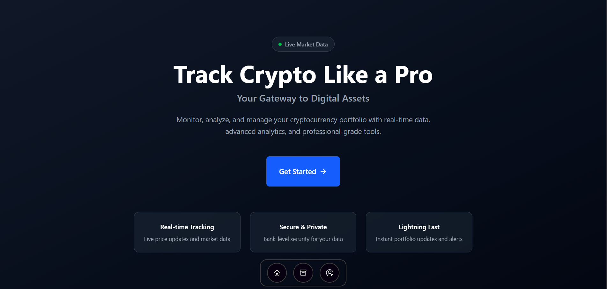

# 💰 Crypto Tracker

A simple and responsive **Crypto Tracker** web application that fetches and displays real-time details of cryptocurrencies. Built using **React**, **Vite**, and **JavaScript**, this project is perfect for anyone interested in tracking crypto coins and staying updated with market trends.

  


---

## 🔍 Features

- 🔄 **Live Crypto Data** – Real-time details of top cryptocurrencies.
- 💹 **Key Metrics** – View price, market cap, rank, volume, and price change.
- 🧭 **User-Friendly UI** – Clean and minimal layout for quick information access.
- 🚀 **Fast Development** – Powered by React and Vite for blazing fast performance.

---

## 📸 Preview

> 

---

## 🛠️ Tech Stack

- **Frontend:** React.js, Vite
- **Language:** JavaScript
- **Styling:** Tailwind
- **API:** [CoinRanking API](https://developers.coinranking.com/api/documentation)

---

## 🚀 Getting Started

### 1. How to use the repo
```bash
git clone https://github.com/Samyra312007/CryptoTracker.git
cd CryptoTracker
npm install
npm run dev
```